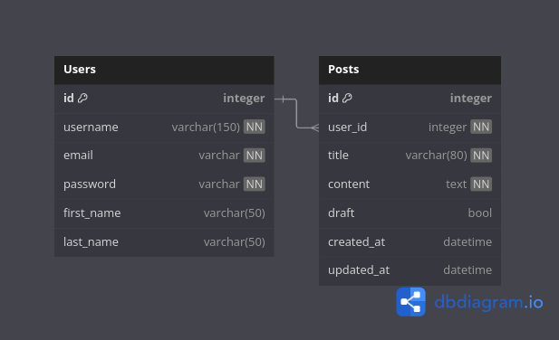

# Projeto de Boas Práticas de Programação (DIM0501)

Um blog sobre os principais assuntos de tecnologia.

## Tecnologias usadas

* Python 3.13
* Django
* HTML
* CSS
* JavaScript

## Como executar o projeto

1. Clone o repositório
```
git clone https://github.com/arthurcostaa/projeto-boas-praticas-programacao.git
cd projeto-boas-praticas-programacao
```

2. Instale as dependências
```
poetry install
```

3. Copie o conteúdo do arquivo `.env.example` para `.env` e define os valores das variáveis de ambiente:
```
cp .env.example .env
```

4. Execute as migrações do banco de dados
```
python manage.py migrate
```

5. Crie um super usuário
```
python manage.py createsuperuser
```

5. Execute o projeto e acesse em `http://localhost:8000/`
```
python manage.py runserver
```

## Diagrama Entidade-Relacionamento

